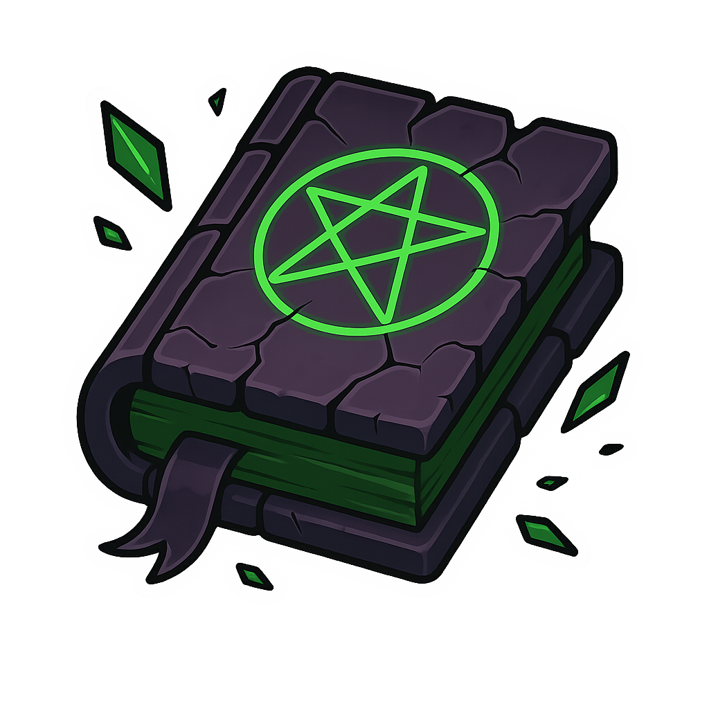
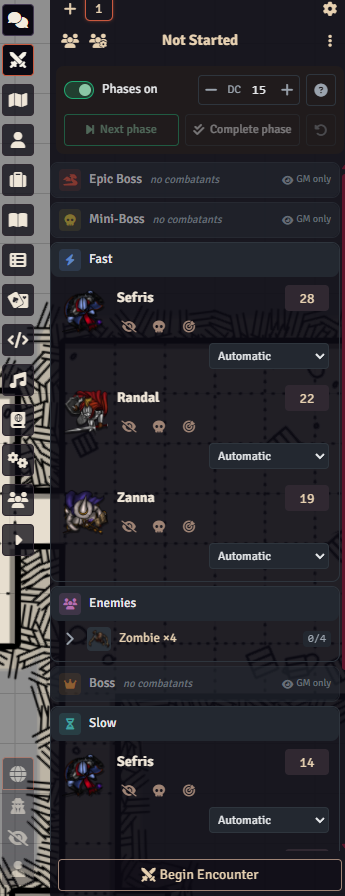
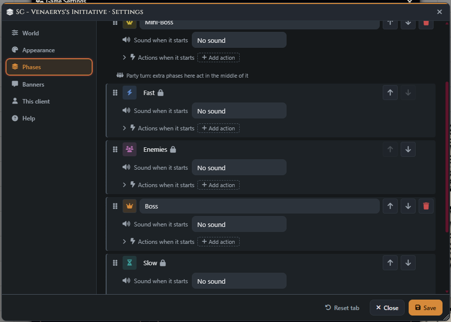
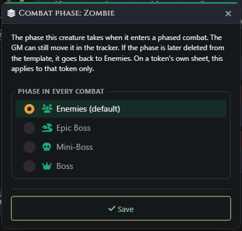
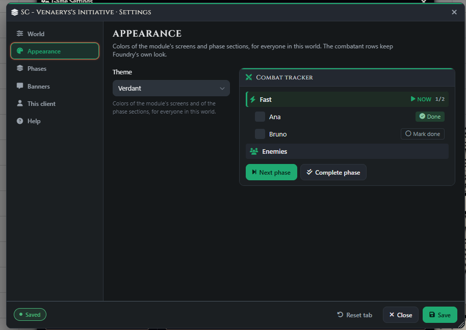
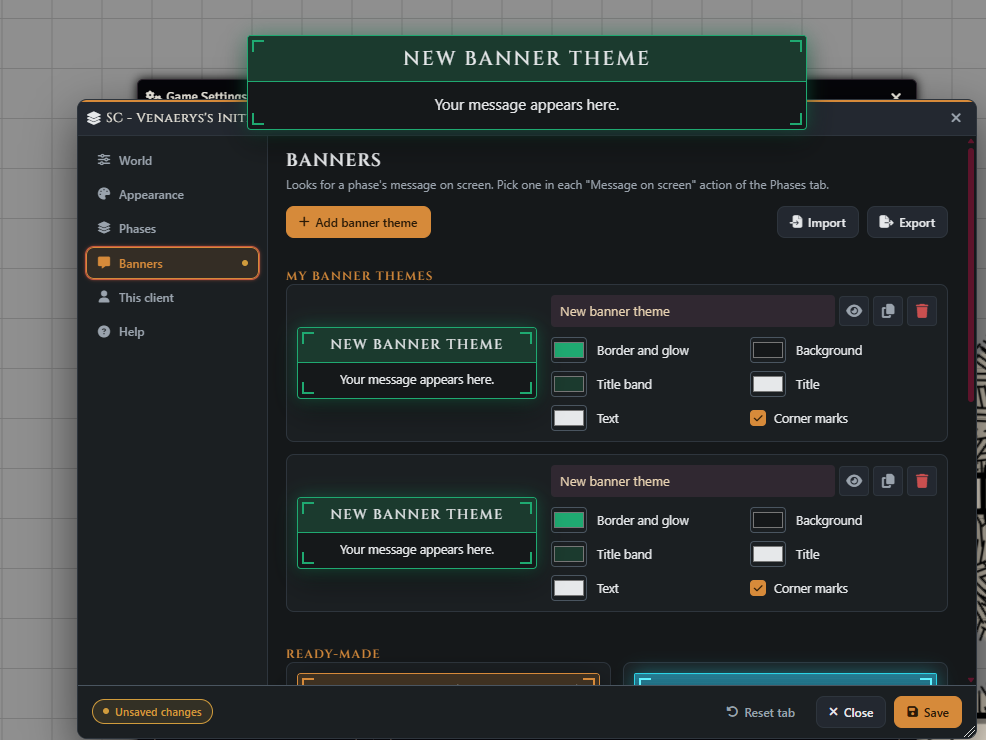
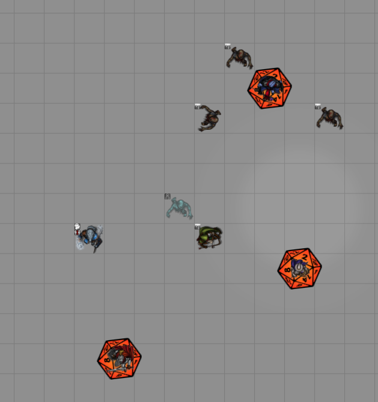

<p align="center">
  <a href="https://www.patreon.com/c/shatteredcodex?utm_source=sc-venaerys-initiative&utm_medium=github&utm_campaign=support_readme">
    
  </a>
</p>

# SC - Venaerys's Initiative

[](https://wiki.shattered-codex.com/modules/sc-venaerys-initiative)
[](https://www.patreon.com/c/shatteredcodex?utm_source=sc-venaerys-initiative&utm_medium=github&utm_campaign=support_readme)
[](https://discord.gg/6mWCQEJEwG)


Run combat in **phases** in **Foundry VTT**. Players roll initiative against a DC, act together in **Fast** or **Slow**, and mark **Done** when they finish. Enemies act together between the player phases, while the GM places bosses and lair actions wherever the encounter needs them.

The module works inside Foundry's own Combat Tracker, in both the sidebar and popout. Everyone in a phase takes a full normal turn; once all its combatants are done, combat advances automatically. Inspired by Venaerys's community request.

## Installation

Requires **Foundry VTT v13 or v14**. No other module is required. See [Supported Systems](#supported-systems) for system-specific behavior.

1. Open **Add-on Modules > Install Module** in Foundry VTT.
2. Paste the manifest URL below and install the module.
3. Enable **SC - Venaerys's Initiative** in your world.

```text
https://github.com/Shattered-Codex/sc-venaerys-initiative/releases/latest/download/module.json
```

## Quick Start

| Phase | Who acts |
| --- | --- |
| **Fast** | Player characters whose initiative meets or beats the DC |
| **Enemies** | Regular enemies, without an initiative roll |
| **Slow** | Player characters whose initiative falls below the DC |

1. Create a combat and add combatants as usual. New combats use phases by default; the GM can toggle **Phases on** before combat starts.
2. Set the **DC** at the top of the tracker. With the default D&D 5e settings, a natural 20 places a character in Fast and a natural 1 in Slow.
3. Players roll initiative when prompted, or use their row's roll button. The GM can use **Roll PCs** to roll all player characters still without initiative.
4. Start combat. Everyone in the current phase acts at the same time, each with a full turn.
5. Mark **Done** when finished. Once everyone in the phase is done, the next occupied phase begins.

A player's native **End Turn** also marks their combatants done. The GM's next and previous turn controls navigate phases. With phases disabled before combat starts, the encounter uses the native tracker and turn order.

For detailed guidance, visit the [Venaerys's Initiative wiki](https://wiki.shattered-codex.com/modules/sc-venaerys-initiative).

## Configuration

Open **Configure Settings > Module Settings > SC - Venaerys's Initiative > Configure**, then select **Save** after editing. Dots mark tabs with unsaved changes.

| Tab | Options |
| --- | --- |
| **World** | Phases in new combats, automatic advancement, shared turn markers, movement/action halves, empty-phase visibility, initiative rolls, critical rules, DC calculation, and player DC visibility |
| **Appearance** | Sixteen Shattered Codex themes or a custom palette made from accent, background, and text colors, with a live preview |
| **Phases** | Phase order, extra creature and event phases, phase sounds, actions when a phase starts, and JSON import/export |
| **Banners** | Preview built-in banner styles, create custom banner themes, and import/export your custom themes |
| **This client** | Bring the combat tracker forward when combat starts and show initiative roll prompts |
| **Help** | Turn events, pending rolls, combatant movement, and compatibility guidance |

Only the GM sees the World, Appearance, Phases, Banners, and Help tabs. Phase order and movement/action settings apply to new combats; existing combats keep their own phase plan.

## Bosses and Extra Phases

In **Phases**, drag phases or use their arrows to position them around **Fast**, **Enemies**, and **Slow**. Those three retain their relative order. Extra phases can be named, recolored, and given their own icons.

Move a combatant using its row's phase selector, drag it onto another phase, or choose **Move to phase…** from its context menu. This pins the assignment for that combat; **Automatic** restores classification. A move that would grant another turn or remove an available turn is deferred until the next round.

On a creature's sheet, the GM can select **Combat phase** from the header menu. This sets its default creature phase for future combats. When item-based suggestions are enabled, an actor item named exactly like a creature phase, ignoring case, can also suggest its assignment. The sheet's explicit choice takes priority.

Use **Add event phase** for lair actions or other encounter events. The phase's **+** adds an event marker: a combatant with no actor that never rolls initiative. The GM marks it done after resolving the event. An event phase without a marker is skipped.

## Movement and GM Controls

The GM can use **Next phase**, **Complete phase**, and **Previous phase** at any time during combat. **Complete phase** marks its members done and advances; **Previous phase** preserves marks and suspends automatic advancement until another mark is changed there.

Enable **Movement and actions** for player phases or all creature phases to run each in two halves. Everyone moves and marks **Moved**, then acts and marks **Done**. Under this table rule, leftover movement is not used in the actions half. The module does not lock tokens or enforce movement allowances.

Additional controls help manage larger encounters:

- Mark or unmark individual combatants done, or use a group header to complete identical creatures together.
- Use **Skip this round** on a future-phase combatant to mark them done in advance.
- Show native turn markers under every member of the current phase still acting, or disable this option to retain Foundry's single marker.
- Hide empty creature phases on the GM's tracker. Event phases remain available so markers can be added.
- Turn off automatic advancement when the table needs manual pacing. While enabled, it waits for dialogs open on the active GM's client.

## Sounds, Banners, and Automation

Each phase can use **No sound**, **Foundry's combat sound**, or **My own file**, with volume and a local preview. Phases are silent by default; Foundry's encounter-start sound remains separate.

Under **actions when it starts**, add a **Message on screen** to announce the phase. Choose a built-in banner style or one created in **Banners**, enter optional text, and set its duration. New default phases announce their names with a banner.

Other actions include sounds, hooks, chat messages, macros, and roll tables. Actions run once per phase per round; going back to a phase does not replay them. Macros must be authored by a GM. Sounds and banners do not run on a player's client when that player cannot see anyone in the phase.

Export **Phases** to share a plan with its sounds and actions. Importing phases replaces the draft plan. Export **Banners** to share custom styles; importing banners merges them by ID. Imports remain unsaved until **Save**. Transfer custom banner themes along with any phase plan that uses them.

## Supported Systems

The core uses Foundry's native combat data. Dedicated adapters provide system rolls and defaults; other systems use their initiative formula or a formula chosen by the GM.

| System | Behavior |
| --- | --- |
| **D&D 5e** | Uses the system initiative roll, NPC CR for an optional **Base + CR** DC, and the kept d20 for natural 20/1 rules. Default formula: `1d20 + @attributes.init.total`. |
| **Pathfinder 2e** | Uses the character's chosen initiative statistic. Natural 20/1 adjusts the result one degree by default. The GM's bulk roll skips the modifiers dialog. |
| **Call of Cthulhu 7e** | Uses the system's optional DEX-roll initiative rule. DC 1, 2, or 3 represents Regular, Hard, or Extreme. With the basic initiative rule, use the optional rule or a formula such as `@characteristics.dex.value - 1d100` against DC 0. |
| **Daggerheart — experimental** | Uses `1d12 + 1d12 + @system.traits.agility.value`; matching dice count as a critical. It does not award Hope or Fear. The system's own spotlight tracker can change turns and rounds independently. |
| **Other systems** | Uses the system's initiative roll where available, or a custom formula; the GM sets the DC manually. |

With **Base + CR**, the DC is the base plus the highest non-defeated enemy CR in Enemies, falling back to all non-defeated enemies when that phase has none. Fractional CR contributes 0. It follows enemies before combat starts, then freezes. Use the calculator beside the DC to recalculate, or type a manual value.

A custom formula reads actor roll data but does not include the system roll dialog's situational bonuses. Use the system roll when those bonuses matter. Systems with custom tracker row templates may lose their row extras while phases are enabled.

## Related Modules

These optional Shattered Codex modules can run from a phase's start actions:

| Module | Phase action |
| --- | --- |
| [SC - Jump Scare](https://wiki.shattered-codex.com/modules/sc-jump-scare) | Play a scare selected from its library |
| [SC - Puzzle Engine](https://wiki.shattered-codex.com/modules/sc-puzzle-engine) | Open, arm, or trigger a puzzle |
| [SC - Resources](https://wiki.shattered-codex.com/modules/sc-resources) | Change or restore configured resources |

Explore the [Shattered Codex wiki](https://wiki.shattered-codex.com) and [Patreon](https://www.patreon.com/c/shatteredcodex?utm_source=sc-venaerys-initiative&utm_medium=github&utm_campaign=support_readme) for more modules.

## Keybindings and Integration

Under **Configure Controls**, assign **Mark my combatants done**, **Advance phase**, **Previous phase**, or **Show the combat tracker**. No keys are assigned by default. Phase navigation is GM-only; marking done respects ownership.

Two hooks are available to macros and other modules:

| Hook | Arguments |
| --- | --- |
| `sc-venaerys-initiative.phaseChange` | `combat, { round, phaseId, previous: { round, phaseId }, reason }` |
| `sc-venaerys-initiative.combatantDone` | `combatant, { done, round, phaseId }` |

Hooks fire on each client. A phase invisible to a player is reported as `null`, and hidden combatants are not reported to that player.

## Screenshots

### Phased Combat Tracker

Player characters are sorted into Fast and Slow around the Enemies phase. The GM can change the DC, assign phases, and manage groups directly in the native tracker.



### Phase Order and Creature Defaults

Configure extra phases around Fast, Enemies, and Slow, with a sound and start actions for each phase. A creature's **Combat phase** dialog sets its default assignment for future encounters.





### Appearance and Banner Themes

The Appearance tab previews the selected theme on a sample tracker. In Banners, customize colors and corner marks, then preview a message on screen.





### Shared Turn Markers

Turn markers highlight multiple tokens still acting in the same phase.



Screenshots from the [module's Imgur album](https://imgur.com/a/mdjIozg), stored in this repository.

## Troubleshooting

| Problem | What to check |
| --- | --- |
| Combat waits for initiative | Roll the remaining characters with their row buttons or **Roll PCs**. The GM can choose **Advance anyway** when offered. |
| A completed phase does not advance | Check automatic advancement, dialogs open on the active GM's client, and whether the phase was revisited with **Previous phase**. |
| A boss enters the wrong phase | Check its sheet's **Combat phase**, item-based suggestions, and the exact phase name. An item called “Boss Fight” does not match “Boss.” |
| A lair phase is skipped | Add an event marker with **+**. Empty event phases do not stop combat. |
| An imported banner style is missing | Import the custom banner themes as well as the phase plan, then save. |
| Initiative uses the wrong bonuses | Select the system roll instead of a custom formula to include system dialog bonuses. |

### Known Limitations

- Foundry still has one current combatant. Start-of-turn automation runs for every member when a phase starts; end-of-turn automation runs only for the member marked by the hourglass. Resolve other members' end-of-turn effects manually when they mark Done.
- Combatants without initiative remain at the end of Foundry's order and can receive system turn events at round changes.
- Disable midi-qol's initiative reroll each round and attack-of-opportunity recording, and Combat Tracker Dock's enemy hiding until the first turn, in phased combats. The module warns GMs about these conflicts.
- A natural 20/1 can reach the combat after its initiative total, briefly showing the character in another phase.
- In Foundry v14, movement history clears when a phase starts.

## Support and Feedback

Questions and ideas are welcome on [Discord](https://discord.gg/6mWCQEJEwG). For bugs or feature requests, open a [GitHub issue](https://github.com/Shattered-Codex/sc-venaerys-initiative/issues). Documentation is available in the [official wiki](https://wiki.shattered-codex.com/modules/sc-venaerys-initiative).

For release automation and the required GitHub secrets, see [Release Setup](https://github.com/Shattered-Codex/sc-venaerys-initiative/blob/main/.github/RELEASE.md).
